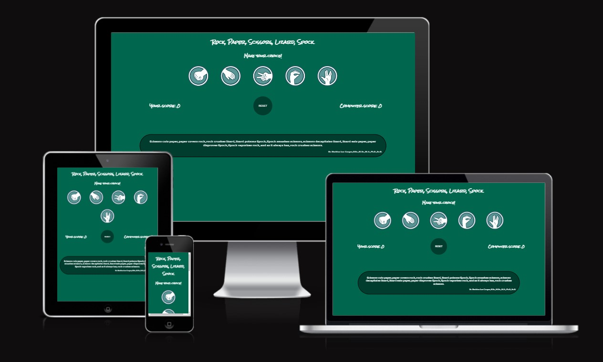
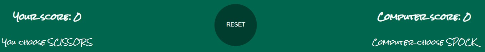
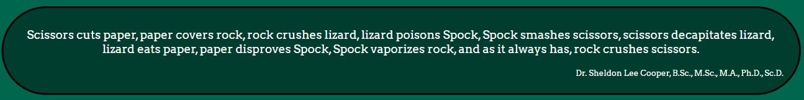
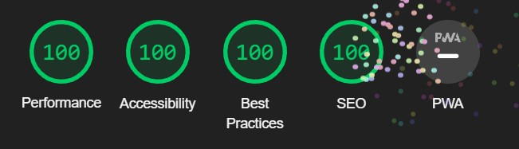

<h1>Rock, Paper, Scissors, Lizard, Spock game</h1>
 

A classic and fun game to decide who goes first in a company of friends made even more fun. With expanded choices from 79 award winning, one of the most popular TV show "The Big Bang Theory".

Users of the game will learn the rules and have a truly random game outcome and if players want to leave their life choices to 100% random decision making, this is it!

 

<h2>Features</h2>

<ul>
<li>Header
<ul><li>To let player know the game they are playing.</li></ul>
</li></ul>

 
<ul><li>Game options
<ul>
<li>5 different choices to pick against computer, with clear images and titles.</li>
<li>These images are interactive buttons, that player can click on their chosen option and the game will run.</li>
<li>When user hovers over the button, it will increase in size.</li>
</ul>
</li></ul>

 
<ul><li>Game Rules
<ul>
<li>When option is selected by the player, their and also computer choice will be shown below the button options.</li>
<li>Winner of the round is shown in the middle of the screen with relative colours, you could also draw, if both player and computer pick the same option.</li>

  
  
  

<li>Player and Computer, left and right of the screen respectively, score counter is just below options and round winner</li>
<li>Reset interactive button,to reset game scores to 0, is located in the middle, between score counters.</li>
</ul>
</li></ul>
  

 
<ul><li>Footer
<ul>
<li>Footer is valuable to new players who are playing the game first time, as it contains rules of the game, explained by a direct quote from  Dr. Sheldon Cooper himself.</li>
</ul>
</li></ul>
  

<h2>Testing</h2>
<ul>
<li>Have tested the game with different browsers, like chrome and firefox, also on a few different android mobile phones and it works without issues.</li>
<li>Have confirmed that decision making in javascript is working correctly.</li>
<li>Have confirmed that fonts and background colours are easy to read and are accessable with lighthouse in dev tools.</li>
</ul>
  

<h2>Bugs</h2>
<ul>
<li>There was a few issues to get the game working along the way, mostly with javascript as it was new to me. A lot of googling involved to find a working solution.</li>
</ul>

 
<h2>Unfixed Bugs</h2>

No unfixed bugs

 
<h2>Validator testing</h2>
<ul>
<li>HTML code has been checked with official W3C validator, no errors.</li>
<li>CSS code has been checked with official W3C Jigsaw validator, no errors.</li>
<li>Javascript code has been checked with JSHint validator, no errors.</li>
</ul>

<h2>Deployment</h2>
<ul>
<li>This site has been deployed to GitHub pages. Steps taken to do it, as follows
<ul><li>In GitHub repository, go to settings</li>
<li>Click on "pages" in navigation on the left</li>
<li>Under "Branch" section, dropdown and select "main", then click save, link with deployed website is at the top of the page.</li>
</ul></li>
<li>The live Website can be found here - <a href='https://marcialas.github.io/RPSLS-game-P2/'>Rock, Paper, Scissors, Lizard, Spock!</a></li>
</ul>

 
<h2>Credits</h2>
<ul>
<li>Icons for the game sourced from <a href='https://icon-library.com/'>Icon-library</a> </li>
</ul>

